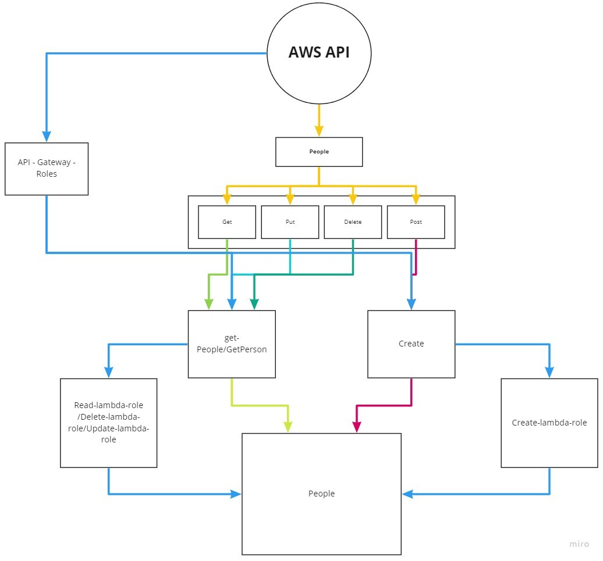

# serverless-api

Created by Bryce Pfingston  

## Installation

npm i { uuid, dynamoose}  
  
## Summary of Problem Domain  

Work in a non-main branch in a new repository called ‘serverless-api’. While your code will all reside in a single repo, your functions will need to be individually .zipped and deployed using common libraries (node_modules) and schema files.

    Create one table for one data model at Dynamo DB
    Create a `Dynamoose` schema to define the structure of your table
    Write lambda functions that will separately perform the proper CRUD operation on the database
    Create your routes using API Gateway
        Routes should integrate with the appropriate Lambda function to perform the operation  

## Links to application deployment  

Githut: https://github.com/bpfingston/serverless-api  
  
## Include embedded UML  

## Talk about your routes

routes: /people

    Method: GET  
        Requires: (optional) query string value 'id': id of object to read
        Output: object data from retrieved record

    Method: POST
        Requires: entire schema information to create object
        Outpus: object data from created record

    Method: PUT
        Requires: query string value 'id': id of item to read
        Output: object data from updated record

    Method: DELETE
        Requires: query string value 'id': id of item to delete
        Output: object data from deleted record
